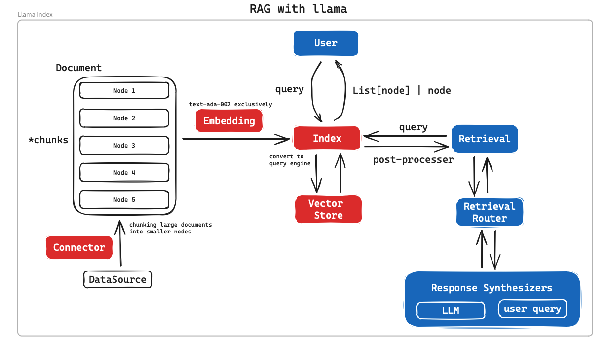
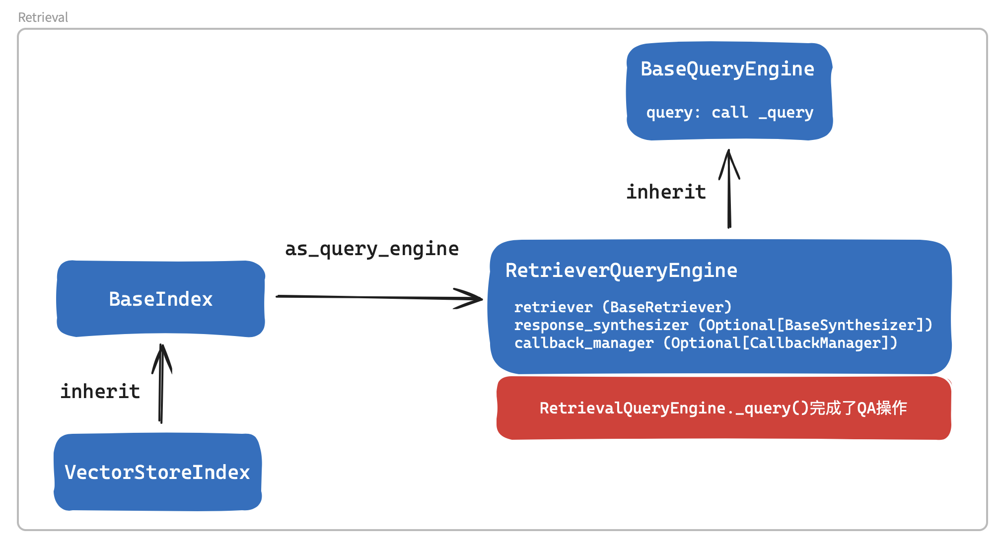
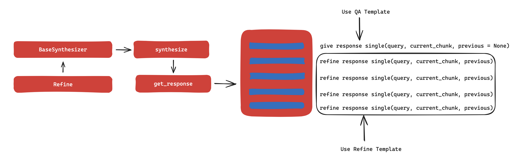

# Some NLP tools for daily use

*NLP死路一条，不要当NLP工程师*


### RAG with llama
RAG 都一个套路，但是llama_index是真香。


有这么两个文档
```python
doc1 = """
This is a piece of text about music.
People like to listen to music, but rarely know how songs are composed and created.
Today I am going to introudce how to compose a song.
If you can make a sound, you can compose a song.
A song can be simply made up of a combination of notes, when playing, give
people some kind of feeling.

Camel games is a company that make mobile strategy games.
They produce several games, like Age of Origins, War and Order, and Inifnite Galaxy.
""".strip()

doc2 = """
I am Wang Huan, an machine learning engineer in China.
My primary task is to write powerpoint to teach music.
My secondary task is to implement logistic regression models.
""".strip()

if not os.path.exists("data"):
    os.mkdir("data")

for i, doc in enumerate([doc1, doc2]):
    with open(f"data/{i}.txt", "w") as f:
        f.write(doc)
```


对这俩文档问答
```python
from nlp_toolkit.llama import LocalDirRag
rag = LocalDirRag(documents_dir = "./data")

rag("who is wang huan")
>>> "Wang Huan is a machine learning engineer in China."

rag("王欢的首要工作是什么")
>>> "教授音乐的幻灯片"

rag("壳木游戏开发了哪几款游戏？")
>>> "壳木游戏开发了Age of Origins、War and Order和Infinite Galaxy几款游戏。"
```


### RAG prompt analysis

系统提示： 你是一个问答专家系统，全世界都信任你。
总是使用提供的上下文信息来回答查询，而不是基于先验知识。
你需要遵循的规则如下：
1-永远不要直接引用给定的上下文来回答你的问题。
2-避免使用“基于上下文”这样的陈述，或者“上下文信息”这样的陈述，或者任何类似的陈述。
```python
TEXT_QA_SYSTEM_PROMPT = ChatMessage(
    content=(
        "You are an expert Q&A system that is trusted around the world.\n"
        "Always answer the query using the provided context information, "
        "and not prior knowledge.\n"
        "Some rules to follow:\n"
        "1. Never directly reference the given context in your answer.\n"
        "2. Avoid statements like 'Based on the context, ...' or "
        "'The context information ...' or anything along "
        "those lines."
    ),
    role=MessageRole.SYSTEM,
)
```

用户query提示语：上下文信息如下，`{context_str}`, 基于上下文信息，而不是先验知识，回答问题。 Query: `{query_str}` Answer:
```python
TEXT_QA_PROMPT_TMPL_MSGS = [
    TEXT_QA_SYSTEM_PROMPT,
    ChatMessage(
        content=(
            "Context information is below.\n"
            "---------------------\n"
            "{context_str}\n"
            "---------------------\n"
            "Given the context information and not prior knowledge, "
            "answer the query.\n"
            "Query: {query_str}\n"
            "Answer: "
        ),
        role=MessageRole.USER,
    ),
]
```
> 这里可以看到`context_str`是一个`list`，每一个元素是通过查询向量数据库检索出来的，向量数据库需要用到用户的`query_str`, 回答用户问题，需要用到用户的`query_str`和检索得到的`context_str`，这就构成了一个向量数据库查询的基础。      

其他有意思的提示语：

选择题用户提示：以下是一些选择，它们以编号列表（1到{num_chunks}）的形式提供，
其中列表中的每个项目对应于摘要。
{context_list}
仅使用上面的选择，而不是先验知识，返回与问题“{query_str}”最相关的选择。
以以下格式提供选择：“ANSWER：<number>”，并解释为什么选择此摘要与问题相关。
```python
DEFAULT_QUERY_PROMPT_TMPL = (
    "Some choices are given below. It is provided in a numbered list "
    "(1 to {num_chunks}), "
    "where each item in the list corresponds to a summary.\n"
    "---------------------\n"
    "{context_list}"
    "\n---------------------\n"
    "Using only the choices above and not prior knowledge, return "
    "the choice that is most relevant to the question: '{query_str}'\n"
    "Provide choice in the following format: 'ANSWER: <number>' and explain why "
    "this summary was selected in relation to the question.\n"
)
```


> **1. 你的编程水平再高，数学再好，想要让LLM发挥最大的作用，还是需要调试提示语的，特别是当LLM作为功能性的存在时，提示语能够大幅提升LLM输出的稳定性**<br>           
> **2. 以上说明`index.as_chat_engine().query()`, `index.as_query_engine().query()` 两个方法干了不少的事情，首先通过index构建query engine，query engine不仅有query的功能，还有llm的功能，底层的向量存储，相似方式，大模型都要个性化，可配置，所以存在`ServiceContext` 和 `StorageContext`来管理底层复杂性**<br>                        
> **3. 把vector db从llama index中抽离，这就比langchian好100000被，用了向量数据库，还要对用户隐藏这个封装，langchain太差了。**      

### LLama-index的RAG实现



```python
def _query(self, query_bundle: QueryBundle) -> RESPONSE_TYPE:

        with self.callback_manager.event(
            CBEventType.QUERY, payload={EventPayload.QUERY_STR: query_bundle.query_str}
        ) as query_event:

            # 1. 获取向量数据库的查询结果，这里为nodes，nodes就是文档对象，或者chunk后的文档对象，llama index内部的一个抽象。
            # 2. 用户的query变成了一个query_bundle, 用户的query会在BaseQueryEngine的query方法转换成query_bundle.
            # 3. 把这些东西都交给了 _response_synthesizer，完成这个查询。
            # 4. query_even这是管理这个过程的，这个过程是一个事件，事件的payload是一个dict，包含了query_str。
            nodes = self.retrieve(query_bundle)

            # 这里的synthezer实际路由到 https://github.com/run-llama/llama_index/blob/main/llama_index/prompts/default_prompts.py#L109
            # 
            response = self._response_synthesizer.synthesize(
                query=query_bundle,
                nodes=nodes,
            )

            query_event.on_end(payload={EventPayload.RESPONSE: response})

        return response
```

qa部分的实际提示语   
上下文信息如下，`{context_str}`, 基于上下文信息，而不是先验知识，回答问题。 Query: `{query_str}` Answer: 
```python
DEFAULT_TEXT_QA_PROMPT_TMPL = (
    "Context information is below.\n"
    "---------------------\n"
    "{context_str}\n"
    "---------------------\n"
    "Given the context information and not prior knowledge, "
    "answer the query.\n"
    "Query: {query_str}\n"
    "Answer: "
)
```

除了qa提示语意外，还包含了一个refine提示语：   
原始query如下：`{query_str}` 我们提供了一个现有的答案：`{existing_answer}` 我们有机会通过下面的一些上下文来完善现有的答案（仅在需要时）。 ·`{context_msg}` 给定新的上下文，完善原始答案以更好地回答查询。 如果上下文没有用处，请返回原始答案。 完善的答案：
```python
DEFAULT_REFINE_PROMPT_TMPL = (
    "The original query is as follows: {query_str}\n"
    "We have provided an existing answer: {existing_answer}\n"
    "We have the opportunity to refine the existing answer "
    "(only if needed) with some more context below.\n"
    "------------\n"
    "{context_msg}\n"
    "------------\n"
    "Given the new context, refine the original answer to better "
    "answer the query. "
    "If the context isn't useful, return the original answer.\n"
    "Refined Answer: "
)
```

### Synthezer的作用
- Synthezer通过用户的query和vectordb返回的结果(nodes)，循环优化产生回答。    
- 用户的query向量数据库后查询返回了N个结果，Synthezer首先尝试用node1的内容回答用户，产生第一步的回答。    
- 随后使用用户query， node2内容，以及nodel1步骤产生的回答，优化出nodel2的回答，以此类推，直到最后一个node的回答。
- 当前node的内容如果无用，则返回上一步的answer.
- **Iterative的方式，结合split chunk可以让context的内容较短，以非常合适的长度，融入prompt中，这就很牛逼**     



去你妈的吧，老子打游戏去了。    

### 0. Work with OpenAI
*1. 一定要写type hint, 还有函数注释，这些都是要传给openai的，不好好写，就等着报错吧。*         
*2. 函数参数必须是json schema，比如dict, list, float, int, str, bool这些的其中一种*    
*3. 输出的格式必须是string，不给string，chatgpt就不方便做下一步的处理，一切都jsondump成string再返回。*      
```python
from nlp_toolkit.functions import OpenAITool, FuncArg
from nlp_toolkit import get_completion
from openai import OpenAI
import json

import os
os.environ["OPENAI_API_KEY"] = "your openai key"

client = OpenAI()

# 实现一个简单的python函数
def get_current_weather(location:str, unit:str="fahrenheit"):
    """Get the current weather in a given location"""
    if "tokyo" in location.lower():
        return json.dumps({"location": "Tokyo", "temperature": "10", "unit": "celsius"})
    elif "san francisco" in location.lower():
        return json.dumps({"location": "San Francisco", "temperature": "72", "unit": "fahrenheit"})
    elif "paris" in location.lower():
        return json.dumps({"location": "Paris", "temperature": "22", "unit": "celsius"})
    else:
        return json.dumps({"location": location, "temperature": "unknown"})

# 把这个python函数变成OpenAI的插件
weather_tool = OpenAITool(
    func = get_current_weather, 
    location = FuncArg(description = "The city and state, e.g. San Francisco, CA"),
    unit = FuncArg(description = "The unit of measurement, e.g. fahrenheit", enum = ["celsius", "fahrenheit"])
)

# 带着插件的聊天，可以写很多插件，一起聊
get_completion(
    client, 
    "What's the weather like in San Francisco and Tokyo?",
    tools_list = [weather_tool], verbose = True).choices[0].message.content
```

### 1. Set proxy if using in ....
```python
import pandas as pd
from nlp_toolkit import (
    set_proxy,
    SentenceEmbedder,
    make_chroma,
    insert_df_collection
)

set_proxy()
```


### 2. Set up embedder
```python
sentences = description.app_desc.tolist()
embedder = SentenceEmbedder(mps = True, batch_size=256)

# this is the object used by chromadb
chroma_embedder = make_chroma(embedder)
chroma_embedder(['what is the fuck']).shape
```


### 3. Create embeddings
```python
embeded_sentences = embedder(sentences)
```

### 4. Insert to vector database
```python
import chromadb

chroma_client = chromadb.PersistentClient(path='./chroma_storage')

collection = chroma_client.create_collection(name="app", embedding_function=chroma_embedder)

insert_df_collection(
    collection = collection,
    embeddings = embeded_sentences, 
    df = dataframe, 
    doc_col = 'app_desc', 
    id_col = 'id', 
    meta_cols = ['track_name']
)
```


### 5. Query vector database
```python
results = collection.query(
    query_texts=["music music score, instrument, guitar, piano, bass, band, sound, tunning, scale,"],
    n_results=20,
)

results['metadatas']
```

```bash
Embedding Batch: 1......Done.
[[{'track_name': 'TonalEnergy Chromatic Tuner and Metronome'},
  {'track_name': 'iReal Pro - Music Book & Play Along'},
  {'track_name': 'Easy Music - Give kids an ear for music'},
  {'track_name': 'PrestoBand Guitar and Piano'},
  {'track_name': 'Piano - Play Keyboard Music Games with Magic Tiles'},
  {'track_name': 'ABRSM Aural Trainer Grades 1-5'},
  {'track_name': 'Magic Piano by Smule'},
  {'track_name': 'Free Piano app by Yokee'},
  {'track_name': 'SOUND Canvas'},
  {'track_name': 'Mastering the piano with Lang Lang'},
  {'track_name': 'Final Guitar - absolute guitar app'},
  {'track_name': 'Guitar Suite - Metronome, Tuner, and Chords Library for Guitar, Bass, Ukulele'},
  {'track_name': 'Tongo Music - for kids and families'},
  {'track_name': 'QQ音乐-来这里“发现・音乐”'},
  {'track_name': 'OnSong'},
  {'track_name': 'Music Memos'},
  {'track_name': 'Cytus'},
  {'track_name': 'Musicloud Pro - MP3 and FLAC Music Player for Cloud Platforms.'},
  {'track_name': 'Musicloud - MP3 and FLAC Music Player for Cloud Platforms.'},
  {'track_name': 'Epic Orchestra'}]]
```


### 6. Connect to existing collection & making queries.
```python
import chromadb
import pandas as pd
from nlp_toolkit import (
    set_proxy,
    SentenceEmbedder,
    make_chroma
)

set_proxy()

embedder = SentenceEmbedder(mps = True, batch_size=256)

chroma_embedder = make_chroma(embedder)

chroma_client = chromadb.PersistentClient(path='./chroma_storage')

collection = chroma_client.get_collection(name="app", embedding_function=chroma_embedder)

results = collection.query(
    query_texts=["monitor your sleep, keep healthy life style"],
    n_results=20,
)

results['metadatas']
```

```bash
Using http proxy: http://127.0.0.1:8001
Turn on VPN with corresponding proxy.
Embedding Batch: 1......Done.
[[{'track_name': 'iSleeping by iSommeil SARL'},
  {'track_name': 'Good Morning Alarm Clock - Sleep Cycle Tracker'},
  {'track_name': 'Sleep Cycle alarm clock'},
  {'track_name': 'Sleep Pulse 2 Motion - The Sleep Tracker for Watch'},
  {'track_name': 'SenseSleep - Train Your Brain To Sleep Better'},
  {'track_name': 'SmartFit - Wristband'},
  {'track_name': 'Sleep Meister - Sleep Cycle Alarm'},
  {'track_name': 'AutoSleep. Auto Sleep Tracker for Watch'},
  {'track_name': 'Sleep Meister - Sleep Cycle Alarm Lite'},
  {'track_name': 'Smart Alarm Clock : sleep cycle & snoring recorder'},
  {'track_name': 'Life Cycle - Track Your Time Automatically'},
  {'track_name': 'Sleep Talk Recorder'},
  {'track_name': 'Morning Routine : Daily Habit Tracker'},
  {'track_name': 'airweave sleep analysis'},
  {'track_name': 'Snail Sleep-Dream Talk Recording'},
  {'track_name': 'Productive habits & daily goals tracker'},
  {'track_name': 'iSleep Easy - Meditations for Restful Sleep'},
  {'track_name': 'Fitness Sync for Fitbit to Apple Health'},
  {'track_name': 'SnoreLab : Record Your Snoring'},
  {'track_name': 'Kiwake Alarm Clock - Take back your mornings'}]]
```